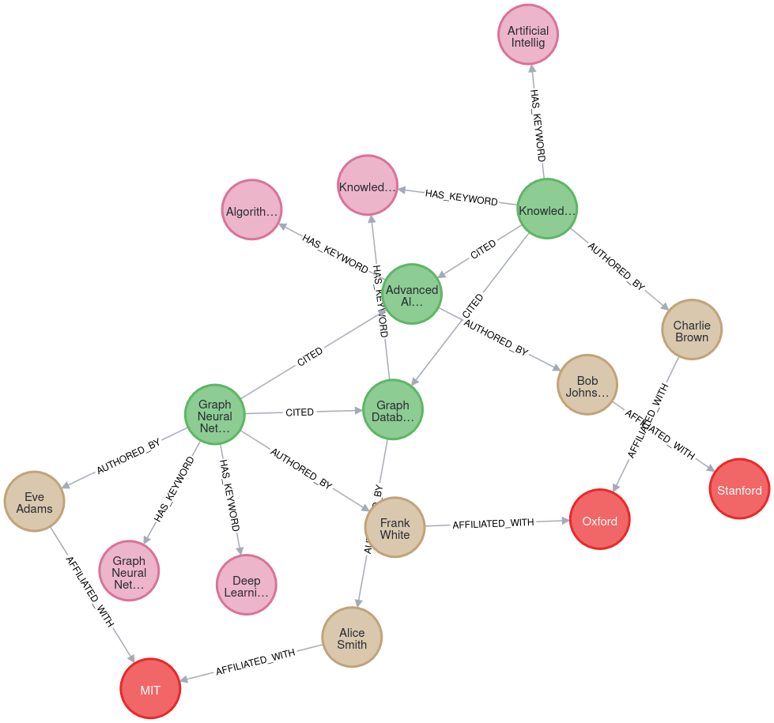

# Task 2: Create a Neo4j graph Database with Cypher Queries with Python

# Introduction

Neo4j is a graph database management system, implemented in Java. Basically, the database and the tables and entries in it are stored as a graph-type data structure, with nodes, edges connecting the nodes and attributes of nodes and edges. Cypher is a query language for Neo4j, similar to the standard SQL query language used in most database systems like MySQL, MariaDB, etc. It is how you interact with the database management system itself, to create new tables, add new entries, display what data is currently in the database, etc. Neo4j has bindings written in other languages to interact with the base Neo4j system, such as in Python.

# Description of the graph database

The demo graph database I created of a research paper knowledge base. It can store data about specific papers, authors, institutions and keywords. The base schema of the graph is as follows:

Entities:

| Node Label     | Properties                  |
|----------------|-----------------------------|
| `:Paper`       | `title`, `year`, `abstract` |
| `:Author`      | `name`                      |
| `:Institution` | `name`, `location`          |
| `:Keyword`     | `term`                      |

Relationships:

| Relationship                                   | Direction                   |
|------------------------------------------------|-----------------------------|
| `{:Author}-[:AFFILIATED_WITH]->(:Institution)` | Author's affiliation        |
| `(:Paper)-[:AUTHORED_BY]->(:Author)`           | Author's relationship       |
| `(:Paper)-[:HAS_KEYWORD]->(:Keyword)`          | Keywords for classification |
| `(:Paper)-[:CITED]->(:Paper)`                  | Citation between papers     |

# The Graph database visualised:

# Requirements

Neo4j installed, preferably through the docker container.

The python package `neo4j`.

# Instructions:

The prerequisites to run this is that you need to have Neo4j installed. The easiest way to do that is to use the docker container, instructions to do so are available on the Neo4j project website.

To run the Python script that creates the graph, you just need the `neo4j` Python package installed. Once that is installed, you can run the script using the command `python graphdb.py`.

# Work done by:

Aseem Athale

athaleaseem@gmail.com
